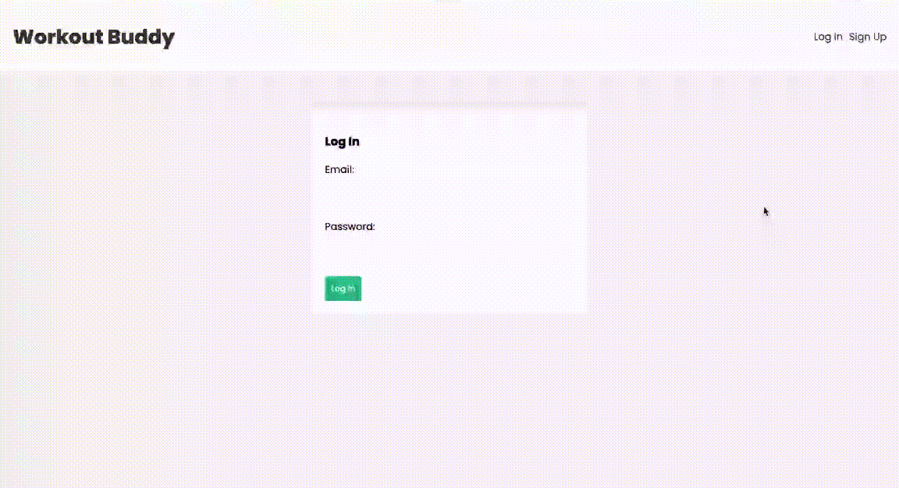

# Workout Tracker

Workout Tracker is a personal project built using the MERN stack that allows users to create an account, login, logout, and add workouts. Each workout entry consists of the exercise name, weight, and reps last recorded.

This project was developed by following a tutorial to learn the MERN stack and understand how to build a full-stack application.

## Features

- User authentication (signup, login, logout)
- Add and manage workouts
- Record exercise name, weight, and reps

## Tech Stack

- **Frontend**: React
- **Backend**: Node.js, Express
- **Database**: MongoDB
- **Styling**: CSS

## Project Setup

1. Clone the repository:
    ```bash
    git clone https://github.com/your-username/workout-tracker.git
    cd workout-tracker
    ```
2. Install dependencies for the backend:
    ```bash
    cd backend
    npm install
    ```
3. Install dependencies for the frontend:
    ```bash
    cd frontend
    npm install
    ```
4. Set up environment variables:
    - Create a `.env` file in the `backend` directory
    - Add the following environment variables:
      ```plaintext
      MONGO_URI = your_mongodb_uri
      PORT = 4000
      SECRET = your_session_secret
      ```

5. Run the backend server:
    ```bash
    cd backend
    npm run dev
    ```
6. Run the frontend server:
    ```bash
    cd frontend
    npm start
    ```

## Tutorial

This project was built by following the [MERN Stack Tutorial](https://www.youtube.com/playlist?list=PL4cUxeGkcC9iJ_KkrkBZWZRHVwnzLIoUE). Special thanks to the author for their comprehensive guide.

## Demo



## Contact
For any inquiries, feel free to reach out to:
- Simone Franceska Emanuelle M. Capio - simone\_franceska\_capio@dlsu.edu.ph
